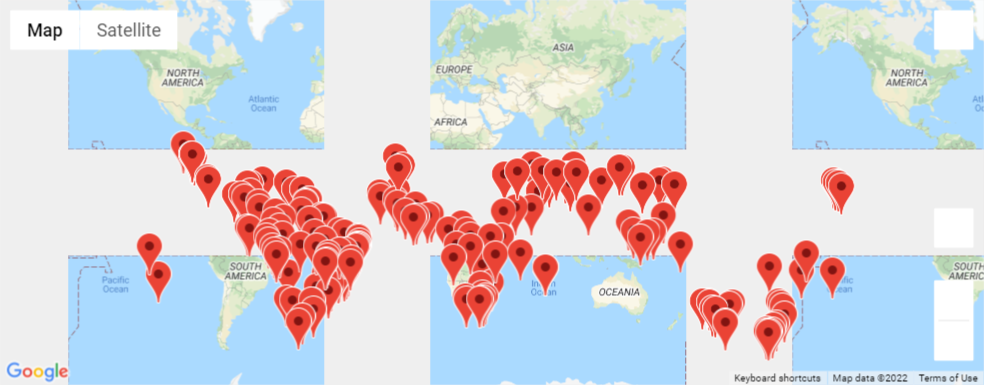
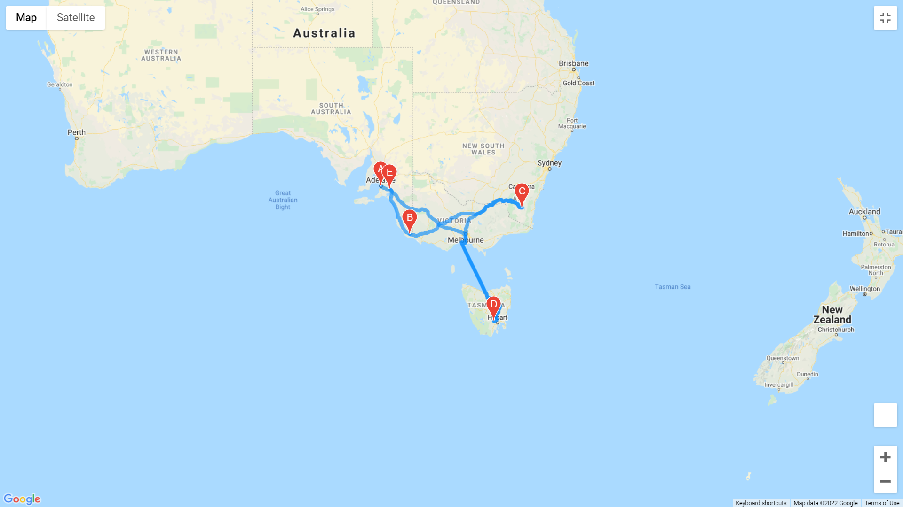
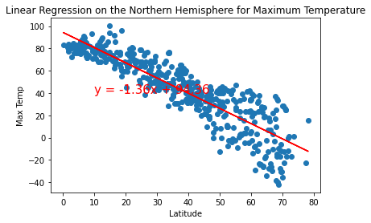
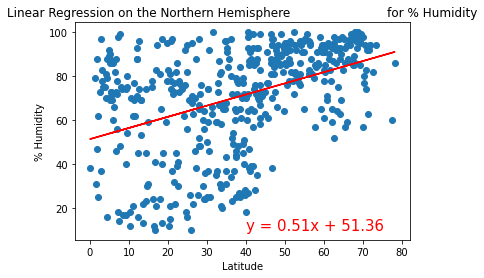
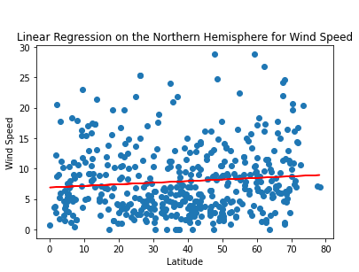
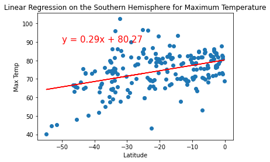
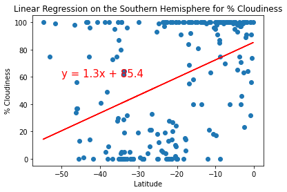
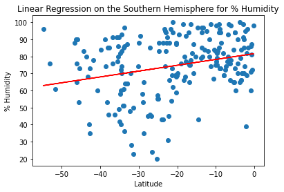
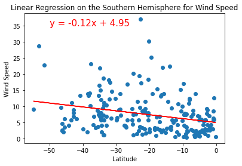

### World_Weather_Analysis
---
### Overview

Travel and tourism offer individuals a glimpse of the world. Weather conditions influence travel behavior and impact overall travel experience. The purpose of this project is to collect, analyze and visualize weather data across cities worldwide and to provide travelers with a tool that will allow them to determine their travel destination based on weather conditions.

### Resources Utilized to Complete Analysis

* CSV Files
* Jupyter Notebook
* Python

### Weather Database
---
A random set of 2,000 latitudes and longitudes were generated, and an API call was made on current weather data for the nearest corresponding cities.

The following data was retrieved from the API call:

* Latitude and longitude
* Maximum temperature
* Percent humidity
* Percent cloudiness
* Wind speed
* Current Weather description

### Vacation Search
---
Based on traveler’s weather preferences (in this case which is me, I selected 65-80 farenheit) travelers can identify potential travel destinations and nearby hotels. The map showcases destinations using pop-up markers on a marker layer-map.

### Sample Travel Destinations

### Vacation Itinerary

Using the Google Directions API, a sample itinerary was created that shows the route between five cities in Australia.

 

### Statistical Analysis

Global city data was plotted, and linear regression was used to find the relationship between the following variables:

* Latitude and Maximum Temperature
* Latitude and Humidity
* Latitude and Cloudiness
* Latitude and Wind Speed

### Scatter Plots
---
Scatter plots were created for each weather parameter against the latitude for all cities to show how different weather parameters change based on latitude.

